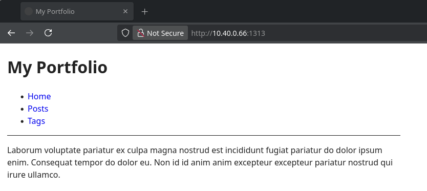
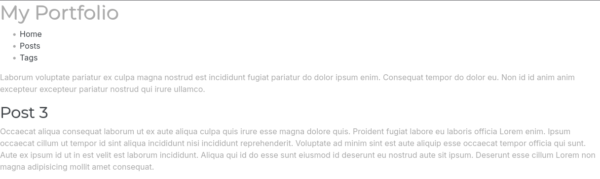
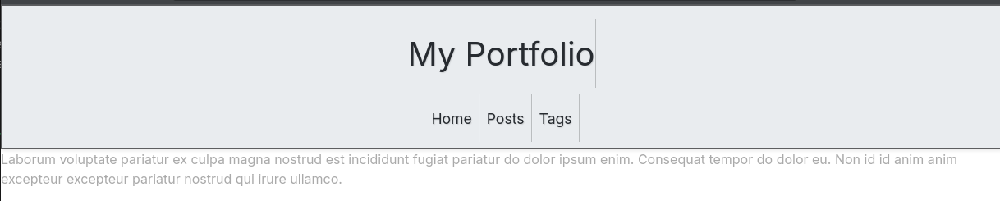
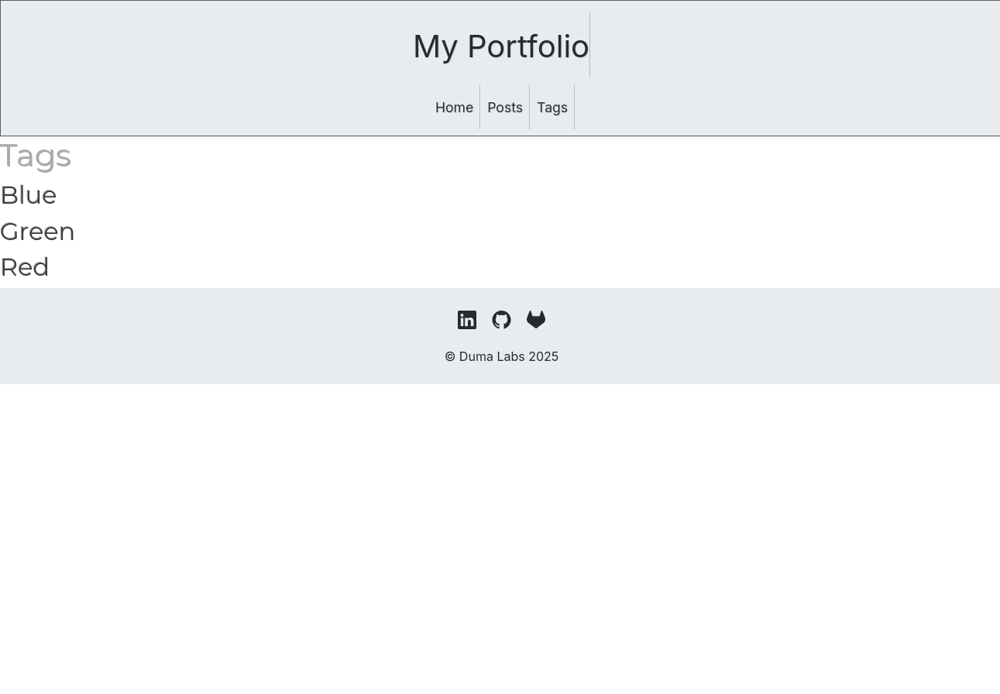
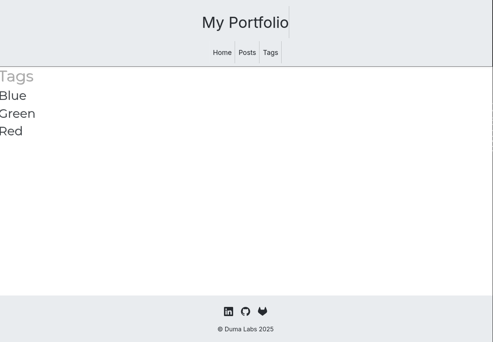
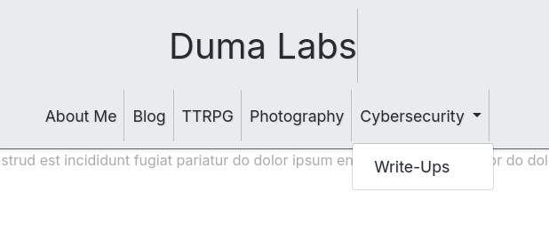
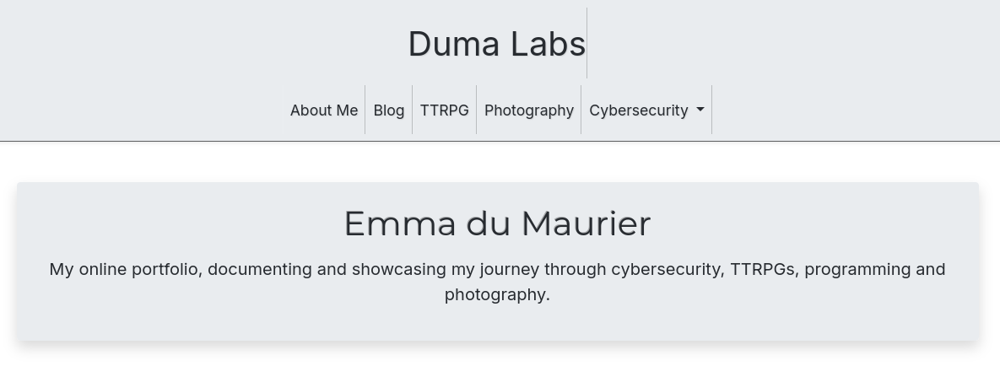

+++
title = 'Portfolio Build Log: Part 3'
subtitle = "Theme Creation & Base Layouts"
description = "Portfolio Build Log: Initial Theme Creation and Setting Up the Base Templates"
date = 2025-10-26T21:51:39Z
lastmod = 2025-10-26T21:51:39Z
categories = ["blog", "hugo"]
tags = ["portfolio", "build-log"]
draft = false
+++

### Creating the Custom Hugo Theme

With the foundations of Hugo set up, now it was on to creating the initial base theme, and customising all the parts that I needed to, so the website fit my needs, and how I wanted it too look and feel.

### Initialising the Custom Theme Structure

I navigated to the root directory where my Hugo project resides:

```bash
cd ~/portfolio
```

Then, using the `hugo new` command, I told it I wanted a new theme and gave it the name `portfolio`:

```bash
hugo new theme portfolio
```

Hugo responded by creating the theme's directory structure:

```
Creating new theme in /home/labemma/portfolio/themes/portfolio
```

This command automatically populated the `themes/portfolio` directory with files and directories necessary for any Hugo theme:

```bash
cd ~/portfolio/themes/portfolio
```

```tree
.
├── archetypes
│   └── default.md
├── assets
│   ├── css
│   │   └── main.css
│   └── js
│       └── main.js
├── content
│   ├── _index.md
│   └── posts
│       ├── _index.md
│       ├── post-1.md
│       ├── post-2.md
│       └── post-3
│           ├── bryce-canyon.jpg
│           └── index.md
├── data
├── hugo.toml
├── i18n
├── layouts
│   ├── _partials
│   │   ├── footer.html
│   │   ├── head
│   │   │   ├── css.html
│   │   │   └── js.html
│   │   ├── head.html
│   │   ├── header.html
│   │   ├── menu.html
│   │   └── terms.html
│   ├── baseof.html
│   ├── home.html
│   ├── page.html
│   ├── section.html
│   ├── taxonomy.html
│   └── term.html
└── static
    └── favicon.ico
```

With the theme created, I needed to tell Hugo to use it. I edited the `hugo.toml` file in the main website directory (not the one in `themes/portfolio`), and I added the theme directive to the bottom. At this point, I also changed the language code and the site title:

```toml
baseURL = 'https://example.org/'
languageCode = 'en-uk'
title = 'My Portfolio'
theme = 'portfolio'
```

Starting the server again and checking the URL confirmed that the default theme scaffolding was now active, and I could see that the page title had changed. This built-in content would help me display aspects of the theme as I went along making changes.


---

### Defining the Base Layout and Dependencies

In the `layouts` directory of the theme, the `baseof.html` file is the main layout file that defines the common structure of all pages for the theme, and on which all other pages will extend.

The initial file is barebones, with very little defined initially:

```html
<!DOCTYPE html>
<html lang="{{ site.Language.LanguageCode }}" dir="{{ or site.Language.LanguageDirection `ltr` }}">
<head>
  {{ partial "head.html" . }}
</head>
<body>
  <header>
    {{ partial "header.html" . }}
  </header>
  <main>
    {{ block "main" . }}{{ end }}
  </main>
  <footer>
    {{ partial "footer.html" . }}
  </footer>
</body>
</html>
```

Instead of editing the common structure here, it makes more sense to edit the referenced partial files (`head.html`, `header.html`, `footer.html`). This ensures consistency across all pages and simplifies maintenance, as any site-wide change only needs to be made in one place.

### Creating Essential Partials and Dependencies

#### Customising and Self-Hosting Bootstrap CSS

To give the portfolio a unique look right from the start, I decided to use a customised version of the Bootstrap CSS. I used an external tool, [Bootstrap.build](https://bootstrap.build/themes), to achieve this efficiency and avoid writing hundreds of lines of SASS/SCSS.

 I selected a free theme as a foundation, then I exported the  code as a single CSS file named `bootstrap.min.css`. I made a `CSS` directory within my theme structure and placed the file there for local hosting.
    
```bash
cd ~/portfolio/themes/portfolio/static
mkdir css
mv ~/Downloads/bootstrap.min.css css/
```

To further define the portfolio's aesthetic, I integrated Google Fonts for custom typography and added Bootstrap Icons for vector-based glyphs.
  
 I created a `style.css` file in the theme's `static/css` directory to hold my custom rules.

**The `style.css` content:**

```css
body {
    font-family: 'Inter', sans-serif;
}

h1, h2, h3, h4, h5, h6,
.display-1, .display-2, .display-3, .display-4, .display-5, .display-6 {
    font-family: 'Montserrat', sans-serif;
}

a.nav-link,
.dropdown-item {
    font-size: 1.1rem !important;
    text-transform: none !important;
}

.navbar .navbar-brand {
    font-size: 2.5rem !important;
}

footer .mb-3 a {
    text-decoration: none !important;
}

footer .mb-3 a:hover {
    text-decoration: none !important;
}

blockquote {
    background-color: #f8f9fa;
    border-left: 5px solid #007bff;
    padding: 15px 20px;
    margin-bottom: 1.5rem;
    font-style: italic;
    color: #495057;
    border-radius: 4px;
}

blockquote p {
    margin-bottom: 0;
}
```

#### Updating head.html to Link All Resources

I updated the `layouts/_partials/head.html` file to include links for the Google Fonts and Bootstrap Icons, ensuring they load correctly alongside the customised Bootstrap and my new `style.css` file. The custom CSS file is intentionally linked last, allowing it to easily override previous styles.

```html
<meta charset="utf-8">
<meta name="viewport" content="width=device-width, initial-scale=1">
<title>
  {{ if .IsHome }}
    {{ site.Title }}
  {{ else }}
    {{ printf "%s | %s" .Title site.Title }}
  {{ end }}
</title>

<link href="https://fonts.googleapis.com/css2?family=Inter:wght@400;700&family=Montserrat:wght@700&display=swap" rel="stylesheet">
<link rel="stylesheet" href="https://cdn.jsdelivr.net/npm/bootstrap-icons@1.11.3/font/bootstrap-icons.min.css">
<link href="{{ "/css/bootstrap.min.css" | relURL }}" rel="stylesheet">
<link rel="stylesheet" href="{{ "/css/style.css" | relURL }}">
```



#### Building the Navigation

I added my custom Bootstrap-ready HTML to the `layouts/_partials/header.html` file. This structure defines the dynamic navigation using Bootstrap classes and leverages Hugo's menu system (`.Site.Menus.main`).

```html
<header>
  <nav class="navbar navbar-expand-lg navbar-light bg-light shadow-sm">
    <div class="container-fluid d-flex flex-column">
      <div class="d-flex justify-content-between align-items-center w-100 py-2">
        <button class="navbar-toggler d-lg-none border-0" type="button" data-bs-toggle="collapse" data-bs-target="#navbarNavCollapse" aria-controls="navbarNavCollapse" aria-expanded="false" aria-label="Toggle navigation">
          <span class="navbar-toggler-icon"></span>
        </button>

        <a class="navbar-brand text-dark fw-bold mx-auto px-0" href="/">
          {{ .Site.Title }}
        </a>

        <div class="d-lg-none" style="width: 48px;"></div>
      </div>

      <div class="collapse navbar-collapse justify-content-center" id="navbarNavCollapse">
        <ul class="navbar-nav">
          {{ range .Site.Menus.main }}
            {{ if .HasChildren }}
              <li class="nav-item dropdown">
                <a class="nav-link dropdown-toggle text-dark" href="#" role="button" data-bs-toggle="dropdown" aria-expanded="false">
                  {{ .Name }}
                </a>
                <ul class="dropdown-menu">
                  {{ range .Children }}
                    <li><a class="dropdown-item text-dark" href="{{ .URL }}">{{ .Name }}</a></li>
                  {{ end }}
                </ul>
              </li>
            {{ else }}
              <li class="nav-item">
                <a class="nav-link text-dark" href="{{ .URL | relURL }}">{{ .Name }}</a>
              </li>
            {{ end }}
          {{ end }}
        </ul>
      </div>
    </div>
  </nav>
</header>
```



#### Linking Bootstrap JavaScript in footer.html

Finally, to ensure the navigation is fully interactive (collapsible menu and dropdowns), I added the script link right before the closing `</body>` tag via the `footer.html` partial.

```html
<footer class="bg-light text-center text-dark py-4 mt-auto">
  <div class="container">
    <div class="mb-3">
      <a href="https://www.linkedin.com/in/emma-du-maurier" target="_blank" rel="noopener noreferrer" aria-label="LinkedIn Profile" class="text-dark mx-2">
        <i class="bi bi-linkedin" style="font-size: 1.5rem;"></i>
      </a>
      <a href="https://github.com/e-duMaurier" target="_blank" rel="noopener noreferrer" aria-label="GitHub Profile" class="text-dark mx-2">
        <i class="bi bi-github" style="font-size: 1.5rem;"></i>
      </a>
      <a href="https://gitlab.com/Dumaurier" target="_blank" rel="noopener noreferrer" aria-label="GitLab Profile" class="text-dark mx-2">
        <i class="bi bi-gitlab" style="font-size: 1.5rem;"></i>
      </a>
    </div>
    <div>
      &copy; Duma Labs {{ now.Year }}
    </div>
  </div>

  <script src="https://cdn.jsdelivr.net/npm/bootstrap@5.3.3/dist/js/bootstrap.bundle.min.js" integrity="sha384-YvpcrYf0tY3lHB60NNkmXc5s9fDVZLESaAA55NDzOxhy9GkcIdslK1eN7N6jIeHz" crossorigin="anonymous"></script>
</footer>
```

### Troubleshooting: Fixing the Floating Footer

After adding the new `footer.html` partial, I noticed a common layout issue: on pages with very little content, the footer would float too high, instead of sticking to the bottom of the browser window.



To fix this, I implemented a **sticky footer** layout using Bootstrap's flexbox utility classes, modifying the core structure defined in `baseof.html`. This forces the main content area to occupy any available vertical space, pushing the footer to the bottom of the viewport.

I updated the `<body>` and `<main>` tags in `baseof.html`:

```html
<body class="d-flex flex-column min-vh-100">
  <main class="flex-grow-1">
    {{ block "main" . }}{{ end }}
  </main>
  </body>
```



### Defining the Navigation and Core Content Layouts

To make the site functional, I configured the main navigation menu and defined the primary content templates.

---

### Setting Up the Main Navigation Menu

I updated the site's title to **'Duma Labs'** and defined the complete navigation structure in the site's root configuration file, `~/portfolio/hugo.toml`. This allows for immediate testing of the menu's functionality and appearance, including the dropdown for "Cybersecurity."

```toml
baseURL = 'https://example.org/'
languageCode = 'en-uk'
title = 'Duma Labs'
theme = 'portfolio'

# --- Menu Configuration ---
[menu]
  [[menu.main]]
    identifier = "about"
    name = "About Me"
    url = "/about/"
    weight = 10

  [[menu.main]]
    identifier = "blog"
    name = "Blog"
    url = "/blog/"
    weight = 20

  [[menu.main]]
    identifier = "ttrpg"
    name = "TTRPG"
    url = "/ttrpg/"
    weight = 30

  [[menu.main]]
    identifier = "tog"
    name = "Photography"
    url = "/tog/"
    weight = 40

  [[menu.main]]
    identifier = "cybersec"
    name = "Cybersecurity"
    # IMPORTANT: The parent item for the dropdown should not have a URL
    weight = 50

  [[menu.main]] # Child item (Write-Ups)
    name = "Write-Ups"
    url = "/cybersec/writeups/"
    parent = "cybersec" # Connects it to the "Cybersecurity" parent
    weight = 10
```



### Preparing Content and Iterative Styling

I replaced the original `bootstrap.min.css` file with a new version that provided a cleaner menu style and better visual foundation. Following this, I created the minimum necessary content structure for layout testing.

 I created the required content directories and test files in the site's main `content/` folder.

```tree
.
├── _index.html
├── about.md
├── blog
│   └── test-post.md
├── cybersec
│   └── writeups
│       └── lab.md
├── tog
│   └── gallery.md
└── ttrpg
	└── rpg-game.md
```

The theme's homepage layout was updated  in `home.html`, to simply display the content from the homepage's Markdown file.

```go
{{ define "main" }}
  {{ .Content }}
{{ end }}
```
   
I created the required homepage content file `content/_index.html`, and added some initial Bootstrap-based content to serve as the site's welcoming section.

```html
<section class="container my-5 p-4 bg-light rounded shadow">
	<div class="text-center text-dark">
		<h1 class="display-5 mb-3">Emma du Maurier</h1>
		<p class="lead">My online portfolio, documenting and showcasing my journey through cybersecurity, TTRPGs, programming and photography.</p>
	</div>
</section>
```



### Defining Core Page Templates

My previous Hugo site had separate `single.html` and `list.html` pages. To control my new theme layouts precisely, I focused on creating the primary template types based on Hugo's template hierarchy: **`page.html`** for individual static pages and **`section.html`** for all content lists.

#### Static Page Layout page.html

This template handles standalone content like the "About Me" page. It includes a call to a `terms.html` partial, which will be necessary for displaying taxonomy tags later.

HTML

```html
{{ define "main" }}
<div class="container my-5">
  <h1 class="text-center">{{ .Title }}</h1>
  <div>
    {{ .Content }}
  </div>
</div>
{{ partial "terms.html" (dict "taxonomy" "tags" "page" .) }}
{{ end }}
```

#### List/Section Layout in section.html

This template handles the content archives for Blog, TTRPG, Photography, and Cybersecurity, providing a loop to display a summary of each item.

HTML

```html
{{ define "main" }}
<div class="container my-5">
  <h1 class="text-center">{{ .Title | default "Blog Posts" }}</h1>
  {{ if not .Paginator.Pages }}
    <p class="text-center lead">There is nothing here yet, please come back later.</p>
  {{ else }}
  <ul class="list-unstyled">
    {{ range .Paginator.Pages }}
    <li class="mb-3">
      <h3><a href="{{ .RelPermalink }}">{{ .Title }}</a></h3>
      <small class="text-muted">{{ .Date.Format "January 2, 2006" }}</small>
      <p>{{ .Summary | plainify | truncate 175 }}</p>
    </li>
    {{ end }}
  </ul>
  {{ end }}
</div>
{{ end }}
```

After saving the files and restarting the server, a check confirmed the immediate visual changes and functionality.

### Defining Content Archetypes (Front Matter and Structure)

To maintain content consistency and streamline the post-creation process, I created three specialised archetype files in the theme directory (`themes/portfolio/archetypes/`). These files pre-populate content documents with the specific front matter fields and Markdown structure needed for each section (Blog, TTRPG, Cybersecurity).

### Creating Section-Specific Archetypes

I created the following archetype files, leaving the default archetype untouched:
* Blog:`themes/portfolio/archetypes/blog.md` for general posts and articles.
* Cybersecurity:`themes/portfolio/archetypes/writeups.md` fir technical reports and challenge documentation.
* TTRPG:`themes/portfolio/archetypes/ttrpg.md` for session logs, reviews, and gaming resources.

#### The Code for the Archetypes

**`themes/portfolio/archetypes/blog.md`**

This archetype provides standard metadata fields for general articles.

Markdown

```toml
+++
title = "{{ replace .Name "-" " " | title }}"
description = "A brief summary of your blog post for SEO or listing pages"
date = {{ .Date }}
lastmod = {{ .Date }}
categories = [] # ["blogging", "general"]
tags = [] # ["tech", "opinion"]
draft = false
+++
```

**`themes/portfolio/archetypes/writeups.md`**

This complex archetype includes structured fields for cybersecurity documentation (e.g., `platform`, `difficulty`) and pre-defines the necessary Markdown headings for a technical write-up.

```toml
+++
title = "{{ replace .Name "-" " " | title }}"
date = {{ .Date }}
lastmod = {{ .Date }}
categories = [""]
platform = ""                # e.g., "TryHackMe", "Hack The Box", "VulnHub"
vulnerability_type = []      # e.g., ["SQL Injection", "XSS", "RCE"]
difficulty = ""              # e.g., "Easy", "Medium", "Hard"
machine_name = ""            # Name of the machine/challenge
images = []                  # Image URLs for the writeup
tags = []                    # e.g., ["SQL Injection", "Nmap", "Metasploit"]
draft = false
+++

## Scenario:

Briefly describe the challenge or machine, including its objective and any key information provided in the challenge prompt.

---

## Process of Investigation:

Detail the steps you took to solve the challenge. Use subheadings for clarity.

### Initial Enumeration:
Describe the initial reconnaissance phase.

### Exploitation:
Explain how you gained the initial foothold, detailing the vulnerability and the exploit used.

### Privilege Escalation:
Detail the steps to escalate privileges, including any local enumeration and the specific exploit or technique.

---

## Challenge Questions and Answers:

If the challenge had specific questions to answer, list them here.

1. Question 1
2. Question 2
3. Question 3

---

## References

List any external resources, tools, or links that were helpful during the challenge.

- [Tool Name](http://example.com/tool)
- [Blog Post on Vulnerability](http://example.com/blog)
```

**`themes/portfolio/archetypes/ttrpg.md`**

This archetype includes fields tailored for tracking game sessions or resources.

```toml
+++
title = "{{ replace .Name "-" " " | title }}"
description = "A summary of this TTRPG session or resource"
date = {{ .Date }}
lastmod = {{ .Date }}
game = "" # e.g., "Dungeons & Dragons 5e", "Call of Cthulhu"
publisher = "" # e.g. "Free League Publishing", "Paizo", "Wizards of the Coast"
campaign = "" # e.g., "Curse of Strahd", "Masks of Nyarlathotep"
characters = [] # e.g., ["Sir Reginald", "Elara Shadowbrook"]
tags = []
draft = false
+++

## System:

## Campaign:

---

## Session

This is where you can write about your TTRPG session, a new adventure idea, or a character build.

---

## Resources:
```

**`themes/portfolio/archetypes/tog.md`**

This archetype is tailored for photography content, distinguishing the post date from the actual photo capture date.

```toml
+++
title = "{{ replace .Name "-" " " | title }}"
description = "A brief summary of your blog post for SEO or listing pages"
date = {{ .Date }}
date_taken = {{ .Date }}
type = "gallery_item"
location = ""
camera = ""
lens = ""
draft = false
+++
```

---

## Setting Up a GitHub Project

The main content archetypes are now set, and ready for use when creating new items. Before I did anything else with the site, I wanted to set up a GitHub Project, to allow me an easy method of keeping ideas, and future plans for the site, to me documented and kept linked with the repository.

To create the project, from the repository in Github, I went to Projects, clicked 'New Project'. Selected a project or template, gave the project a name and then created the project.

I selected a Kan-ban board style, mostly because I am familiar with this type of layout. I just need the four lists for now, *To Do*, *In Progress*, *In Review* and *Done*. I created some initial To-Do items, and would use this to keep a track of any ideas or changes, while having them linked to my repository, so they're easier to keep view of, manage, and work through.

## Updating Content

Before copying my content over, I wanted to make sure that every content folder had a basic `_index.md` file, this would container a title. and that draft was false

```toml
+++
title = "section title"
draft = false
+++
```

Migrating the data from my previous site was very simple, and I could just copy over the content directly, then make some minor edits to the markdown files, and check they all display correctly.

Finally, I wanted to to rename the theme, to match my site, and move the archetypes from the theme directory, to the main directory. This makes the theme a little more basic, and allows the main customisation to be done directly for the website, should the theme be used elsewhere, and different content types needs to be used.

```bash
mv themes/portfolio themes/duma-theme
```

## What's Next?

The main foundations for the site are done. I have frontmatter set for new content, I have a working menu, I have some initial content created, or moved into, my new portfolio. The next step was to now set up GitHub Actions to deploy my site.

However, this would be a little different to my last portfolio, where I published the site locally, then had GitHub copy the contents of the `public` directory to my VPS, this time the Action would build the site in GitHub, then push this to my VPS.

## References
- [Free Bootstrap Builder](https://bootstrap.build/)
- [Let's Create a New Hugo Theme](https://pakstech.com/blog/create-hugo-theme/)
- [Hugo Site Customization](https://bootstrap.hugoblox.com/getting-started/customization/)
- [How to Create Custom Hugo Themes](https://draft.dev/learn/creating-hugo-themes)
- [Creating Hugo Themes: A Comprehensive Guide](https://manikandaraj.com/2025/03/creating-hugo-theme-a-comprehensive-guide/)
- [Setting up default hugo frontmatter](https://ajot.me/posts/setting-up-default-hugo-frontmatter/)