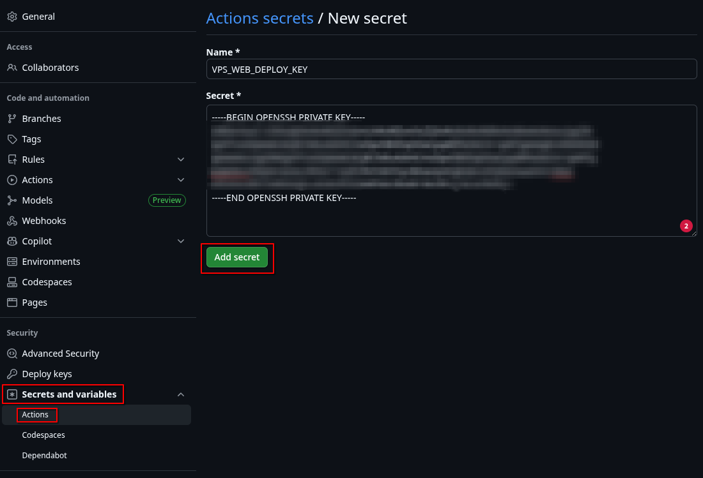

+++
title = 'Portfolio Build Log: Part 4'
subtitle = "Creating the Deployment Pipeline"
description = "Setting up GitHub Actions for my Blog CI\\CD Pipeline"
date = 2025-11-02T15:44:04Z
lastmod = 2025-11-02T15:44:04Z
categories = ["blog", "hugo"]
tags = ["portfolio", "build-log"]
draft = false
+++

### Final Deployment Strategy and CI/CD Pipeline

With the custom theme foundation established, this phase focused on migrating the final content and establishing a robust **Continuous Integration/Continuous Deployment (CI/CD)** pipeline using **GitHub Actions** and my existing Dockerised Virtual Private Server (VPS) infrastructure. This setup automates the build and deployment process, ensuring that every time code is pushed to the `main` branch, the live site updates automatically.

### Prerequisites and Strategy

The deployment requires three core components, which need to be configured before writing the runner script:

1. **Deployment Directory on VPS:** A dedicated, secure location on my Ubuntu VPS where the built Hugo files (`public/` contents) will be placed.
2. **Deployment User & SSH Key:** A secure, dedicated SSH keypair for the GitHub Action runner to log into the VPS. This key needed to be stored securely as a **GitHub Secret**.
3. **SSH Access for Deployment:** The VPS must be configured to accept connections from the runner using this key.

#### Preparing the VPS (Target System)

**Important Note on Hosting Environment:**

For my production VPS, I use **Docker** to containerise the web server using the configuration shown below. This offers better isolation and management for future services.

```yaml
services:
  nginx:
    image: nginx:latest
    ports:
      - "8080:80"
    volumes:
      - ./site:/usr/share/nginx/html
    networks:
      - proxy
    restart: always

networks:
  proxy:
    external: true
```

**For the purpose of this CI/CD guide, the choice of web server is agnostic.** Readers following along can use **Nginx, Apache, Caddy, or any other web server** they prefer. The critical requirement is to ensure your final content directory is correctly mapped as the web server's content directory.

My specific deployment directory is mapped inside the container via this volume:

```yaml
volumes:
  - ./site:/usr/share/nginx/html
```


I SSH'd in to my VPS and generated a new key that I would use for my GitHub deployment.  For this key, I left the passphrase empty, as I don't want to have to enter it every time I push to my repository, and need the GitHub deployment to work without direct input.

```bash
ssh-keygen -t ed25519 -f ~/.ssh/web_deploy_key
```


This creates the private and public key directly on the server, so I didn't need to copy anything to the server, but I needed to make sure that this key was in the authorised keys on the VPS

```bash
cat ~/.ssh/web_deploy_key.pub >> ~/.ssh/authorized_keys
```

Now to allow the connection to work correctly, I needed to import the private key in to my GitHub Secrets. I used `cat`on my VPS to display my private key:

```bash
cat ~/.ssh/web_deploy_key
```

The I copied entire output of the private key (including the `-----BEGIN...` and `-----END...` lines), and in GitHub, I went to my repository settings, into `Settings`, then `Security`, `Secrets and Variables`, then added a `New repository secret`. I pasted the copied private key into the `Secret` text box, and gave it a Name.


 
Since the only place this private key should exist is now on GitHub Secrets, I deleted the file from my VPS for better security.

```bash
rm ~/.ssh/web_deploy_key
```

I also needed to create some additional secrets, one for the IP address of my VPS, and one for the User to log in with

`VPS_IP`: The address of my VPS.
`VPS_USER`: The user account on the VPS that has SSH access.
`VPS_DEPLOY_PATH`: Path on the host to send the files to.
`VPS_PORT`: The port to my VPS.

---

### Creating the GitHub Actions Workflow

The runner defines the actual workflow, and to enable this I created a file named `deploy.yml` inside the repository structure at `.github/workflows/`.

```bash
mkdir -p .github/worfklows
vim .github/worfklows/deploy.yaml
```

The `deploy.yml`file then needed to have the workflow configuration added to it.

```yaml
name: Deploy Hugo Site to VPS via SSH Agent

on:
  push:
    branches:
      - main
  workflow_dispatch:

jobs:
  deploy:
    runs-on: ubuntu-latest
    environment: production

    steps:
      # 1. Checkout Code and Theme (Necessary for Hugo)
      - name: Checkout Repository
        uses: actions/checkout@v4
        with:
          submodules: true 
          fetch-depth: 0

      # 2. Setup Hugo (Necessary for Hugo)
      - name: Setup Hugo Environment
        uses: peaceiris/actions-hugo@v3
        with:
          hugo-version: 'latest'
          extended: true 

      # 3. Build Site (Necessary for Hugo)
      - name: Build Site
        run: hugo --minify

      # 4. Set up SSH Agent and load the key
      - name: Set up SSH
        uses: webfactory/ssh-agent@v0.5.3
        with:
          ssh-private-key: ${{ secrets.VPS_WEB_DEPLOY_KEY }}

      # 5. Sync files with rsync
      - name: Sync files with rsync
        run: |
          echo "Starting rsync to VPS..."
          rsync -avz -e 'ssh -v -p ${{ secrets.VPS_PORT }} -o StrictHostKeyChecking=no' --delete public/ ${{ secrets.VPS_USER }}@${{ secrets.VPS_IP }}:${{ secrets.VPS_DEPLOY_PATH }}
          echo "rsync completed."

      - name: Execute remote commands via SSH (Verification)
        uses: appleboy/ssh-action@v1.2.2
        with:
          host: ${{ secrets.VPS_IP }}
          username: ${{ secrets.VPS_USER }}
          key: ${{ secrets.VPS_WEB_DEPLOY_KEY }}
          port: ${{ secrets.VPS_PORT }}
          script: |
            echo "Deployment path content:"
            ls -la ${{ secrets.VPS_DEPLOY_PATH }}
```

Once the file was created, I pushed this to the repository and then checked the GitHub actions.

After some failures, due to using incorrect variables that were different between my VM and my VPS, I was able to see the action had completed successfully.

With that complete, and seeing that the action had completed and my live website had been updated, I trimmed and re-used a bash script I had set up, just to streamline the local Git workflow.

I created a new file in the root of my website directory, and named this `deploy.sh`.

```bash
#!/bin/bash

git_comment="$1"

# Script will fail to run if no comment is required.
if [ -z "$git_comment" ]; then 
  echo "Error: A commit message is required."
  exit 1 
fi

# Add changes to Git
echo -e "Adding changed files to git..."
git add .
echo -e "All files added.\n"

# Commit the changes
echo -e "Commiting the changes..."
git commit -m "$git_comment"
echo -e "All changes commited.\n"

# Push changes to GitHub repository
echo -e "Pushing changes..."
git push origin main
echo -e "Changes pushed.\nGitHub action will now build and deploy the site."
```

I then made it executable so that it was quicker, and easier, to use when I was updating my website.

```bash
chmod +x deploy.sh
```

And performed a final test with
```bash
./deploy.sh "Set up local Git workflow script"
```

```terminal
❯ ./deploy.sh "Set up local Git workflow script"
Adding changed files to git...
All files added.

Commiting the changes...
[main 6f75c97] Set up local Git workflow script
 1 file changed, 24 insertions(+)
 create mode 100644 deploy.sh
All changes commited.

Pushing changes...
Enumerating objects: 4, done.
Counting objects: 100% (4/4), done.
Delta compression using up to 32 threads
Compressing objects: 100% (3/3), done.
Writing objects: 100% (3/3), 568 bytes | 568.00 KiB/s, done.
Total 3 (delta 1), reused 0 (delta 0), pack-reused 0 (from 0)
remote: Resolving deltas: 100% (1/1), completed with 1 local object.
To github.com:e-duMaurier/portfolio-website.git
   917c534..6f75c97  main -> main
Changes pushed.
GitHub action will now build and deploy the site.
```

## References

- [GitHub Actions](https://github.com/features/actions)
- [Automatic Hugo Deployment with GitHub Actions](https://mattdyson.org/blog/2025/04/automatic-hugo-deployment-with-github-actions/)
- [GitHub Actions for Hugo](https://github.com/marketplace/actions/hugo-setup)
- [Peaceiris/Hugo Actions](https://github.com/peaceiris/actions-hugo)
- [GitHub Actions/Checkout](https://github.com/actions/checkout)
- [Webfactory/SSH Agent](https://github.com/webfactory/ssh-agent)
- [Appleboy/SSH Actions](https://github.com/appleboy/ssh-action)
- [Adding arguments and options to your Bash scripts](https://www.redhat.com/en/blog/arguments-options-bash-scripts)
- [Nginx](https://nginx.org/en/)
- [Nginx Proxy Manager](https://nginxproxymanager.com/)
- [Docker](https://www.docker.com/)
