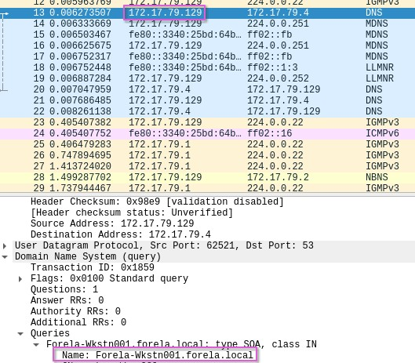
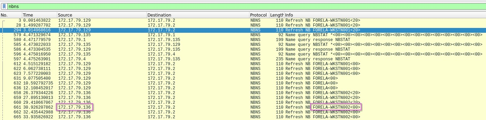
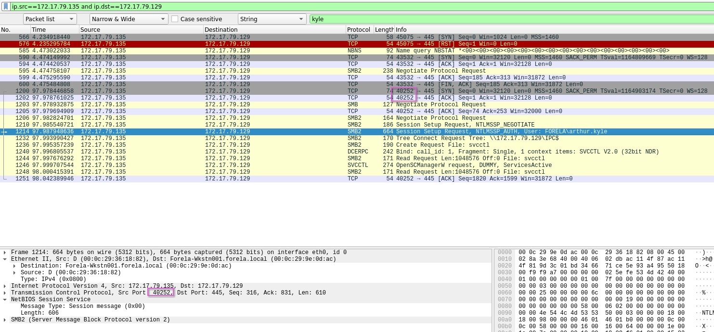
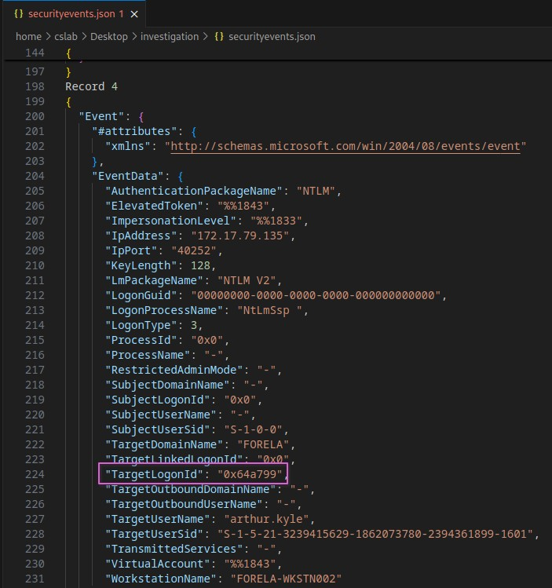
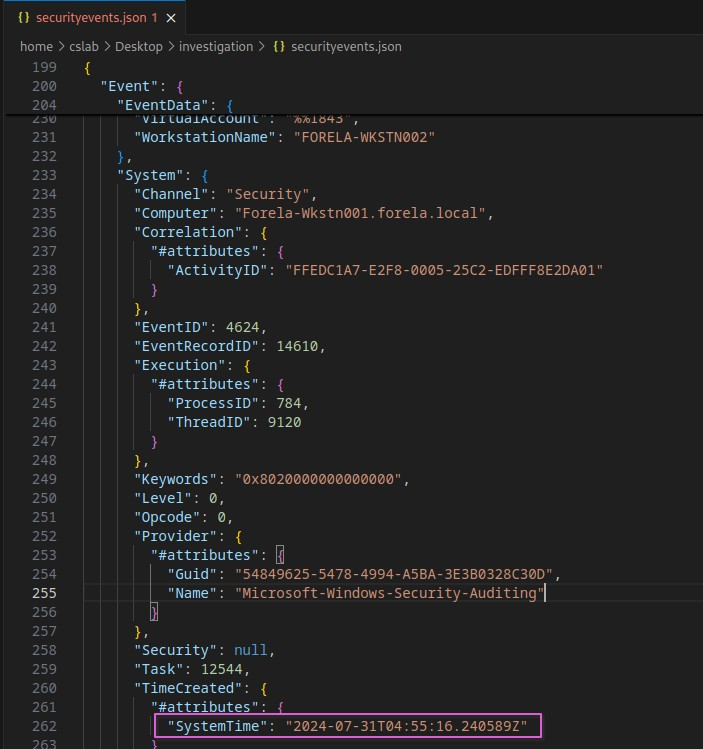
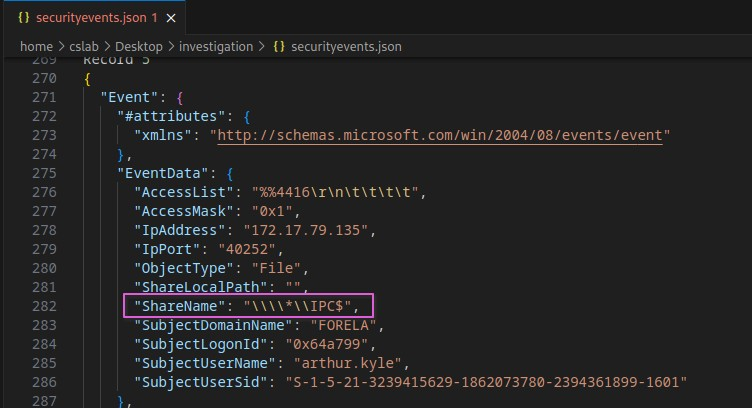

+++
title = "Reaper"
date = 2024-11-11T10:01:33+01:00
lastmod = 2025-08-02T23:07:32+01:00
categories = ["Cybersercurity", "Writeup", "HTB", "Sherlock"]
tags = ["Cybersercurity", "Writeup", "HTB", "Sherlock"]
platform = "Hack Thje Box"
difficulty = "Very Easy"
vulnerability_type = [] 
machine_name = "Reaper"
images = []
draft = false
+++

## Scenario:

Our SIEM alerted us to a suspicious logon event which needs to be looked at immediately. The alert details were that the IP Address and the Source Workstation name were a mismatch. You are provided a network capture and event logs from the surrounding time around the incident timeframe. Correlate the given evidence and report back to your SOC Manager.

This is my write-up of the retired ‘Sherlock’ challenge, Reaper. Sherlocks are investigative challenges, to help develop and test defensive cybersecurity skills. Retired content on Hack The Box, has write-ups enabled, and I think that this would be a good opportunity to work through a challenge, and practice my documentation while working through the challenge.

---

## Process of Investigation:

After extracting the provided zip file for the challenge, there are two files, `Security.evtx`, a Windows event log file, and a packet capture file, `ntlmrelay.pcapng`.

Opening the pcap file, then checking one of the DNS queries, the source IP address of 172.17.79.129 has the name Forela-Wkstn001.forela.local. I did not see any DNS records for Forela-Wkstn002, but when looking at the packet capture in Wireshark, I did see the NBNS (NetBIOS Name Service) protocol. So, I selected nbns as the display filter, and this indicated that Wkstn002 has the IP address of `172.17.79.136`.



Changing the display filter to smb2, and then using a string filter on the packet list for `AUTH`, Wireshark found a Session Setup Request, with an AUTH for the user Arthur Kyle. Knowing the IP address for Forela-Wkstn002, seeing the communication between this device and IP address 172.17.79.136, would indicate that this was the device being used by the attacker.



Following the TCP stream from this event, and looking for any SMB2 Connect Request, I then saw numerous attempts to connect to the `\\DC01\Trip` share. To find the port, I then set the display filter to narrow down the source IP to be the attackers’ device, and the destination to be the IP address of Forela-Wkstn001. Then I looked for TCP connections that were around the user login attempt. The TCP packets had the source port `40252`, and reviewing the SMB packets, confirmed that these had the same port value.



Using `evtx_dump`, I exported the `Security.evtx` file to a JSON file, then opened this in an editor.

```bash
evtx_dump -f securityevents.json -o json Security.evtx
```

Looking through the events, I found the record that contained port `40252`, and this record displayed the LogonID, `0x64a799`, used to log in with the stolen user account. This record also confirmed the username, `arthur.kyle` and the workstation name `FORELA-WKSTN002`.



As part of the key:value data that is stored as part of the record, the system time is also logged, so I could identify when the malicious logon occurred, at `2024-07-31T04:55:16.240589Z`.



Finally, after the logon, the next record referenced a share name that was accessed. This was confirmed to be part of the same sequence of events due to the matching port number, user name and logon ID as the previous record. The share that was accessed by the attacker was displayed as `\\\\\IPC$`. Taking in to account ’escape’ characters in the code view of the JSON, this would be then converted to `\\IPC$`.




---

## Challenge Questions and Answers

1. What is the IP Address for Forela-Wkstn001? `172.17.79.129`
2. What is the IP Address for Forela-Wkstn002? `172.17.79.136`
3. Which user account’s hash was stolen by attacker? `Arthur Kyle`
4. What is the IP Address of Unknown Device used by the attacker to intercept credentials? `172.17.79.136`
5. What was the fileshare navigated by the victim user account? `\\DC01\Trip`
6. What is the source port used to logon to target workstation using the compromised account? `40252`
7. What is the Logon ID for the malicious session? `0x64a799`
8. The detection was based on the mismatch of hostname and the assigned IP Address.What is the workstation name and the source IP Address from which the malicious logon occur? `FORELA-WKSTN002, 172.17.79.135`
9. At what UTC time did the malicious logon happen? `2024-07-31 04:55:16`
10. What is the share Name accessed as part of the authentication process by the malicious tool used by the attacker? `\\*\IPC$`
---

## References

- https://app.hackthebox.com/sherlocks/Reaper
- https://github.com/omerbenamram/evtx
