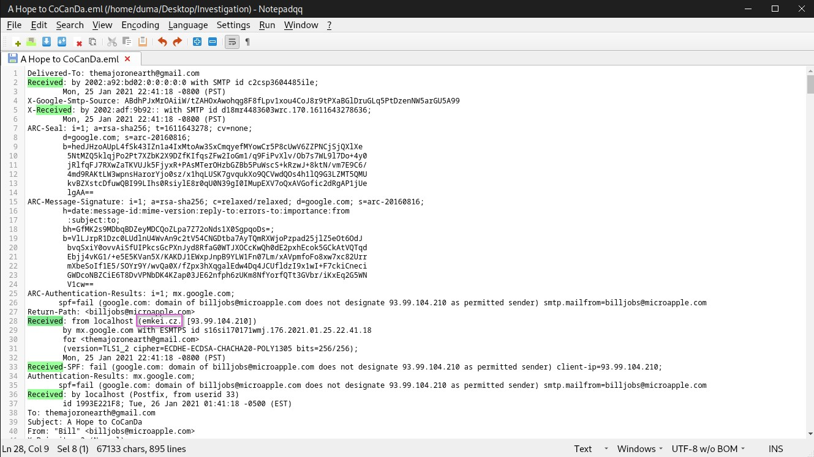
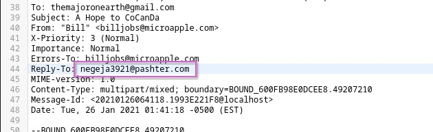
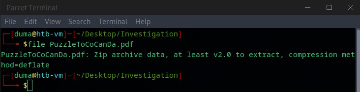
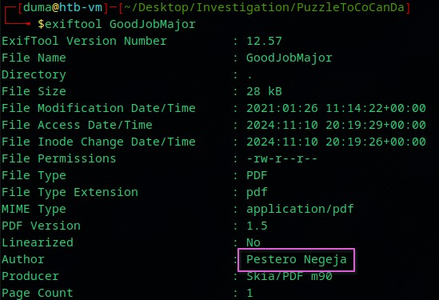
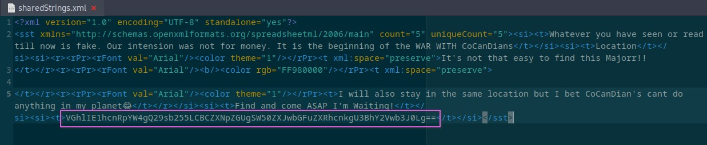
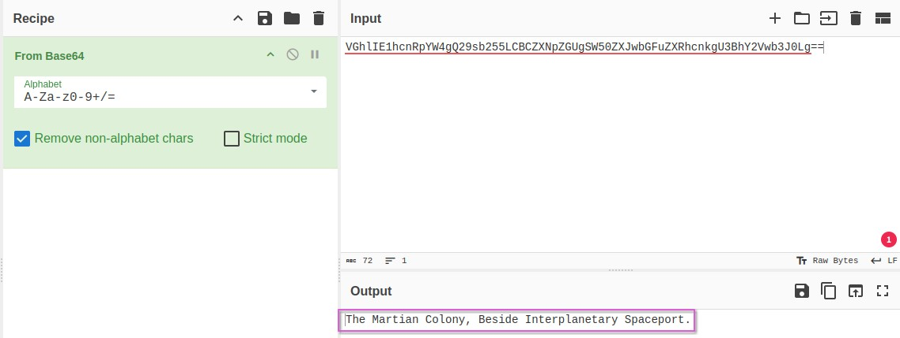

+++
title = "The Planets Prestige"
date = 2024-11-10T22:06:33+01:00
lastmod = 2025-08-02T22:11:39+01:00
categories = ["Cybersercurity", "Writeup", "BTLO", "CTF-Like", "Challenge"]
tags = ["Email Client", "Text Editor"]
platform = "Blue Team Labs Online"
vulnerability_type = [] 
difficulty = "Easy"
machine_name = "The Planets Prestige"
images = []
draft = false
+++

## Scenario:

CoCanDa, a planet known as ‘The Heaven of the Universe’ has been having a bad year. A series of riots have taken place across the planet due to the frequent abduction of citizens, known as CoCanDians, by a mysterious force. CoCanDa’s Planetary President arranged a war-room with the best brains and military leaders to work on a solution. After the meeting concluded the President was informed his daughter had disappeared. CoCanDa agents spread across multiple planets were working day and night to locate her. Two days later and there’s no update on the situation, no demand for ransom, not even a single clue regarding the whereabouts of the missing people. On the third day a CoCanDa representative, an Army Major on Earth, received an email.

---

## Process of Investigation:

ℹ️ While any URLs, email addressed, domains, and IP addresses may not be actual references, just in case that any of these do point to anything that can be directly linked to, I have 'defanged' any references. 
All references will have the square brackets '[]' placed around any periods '.' or at '@' symbols.

****Extracting the File:**** 
The zip file contained only one file, an email file ‘A Hope to CoCanDa.eml’, and I opened this in a text editor, so that I could get a full view of all the data.

****Finding the Email Service Domain:**** 
I first searched the text representation of the email for the word ‘Received’ so that I could quickly scan the document for any reference to the originating domain.
I find the line ‘Received: from localhost (emkei[.]cz. [93[.]99[.]104[.]210])’ which indicated the email service used was emkei[.]cz



****The Reply-To Email Address:**** 
Searching through the document for ‘Reply-To’ pointed me to the email address egeja3921[@]pashter[.]com



****Email Attachments:****
Opening the email in a mail application, I could now see the message content in the email.

Hi TheMajorOnEarth,
The abducted CoCanDians are with me including the President’s daughter. Dont worry. They are safe in a secret location.
Send me 1 Billion CoCanDs🤑 in cash💸 with a spaceship🚀 and my autonomous bots will safely bring back your citizens.
I heard that CoCanDians have the best brains in the Universe. Solve the puzzle I sent as an attachment for the next steps.
I’m approximately 12.8 light minutes away from the sun and my advice for the puzzle is
“Don’t Trust Your Eyes”
Lol😂

There was also an attachment on the email, a document named as ‘PuzzleToCoCanDa.pdf’, which I then downloaded to my investigation folder.

****Extracting the Attachment:****
Checking the downloaded file from the email with the file command, the PDF file is actually a zip file, that has been renamed.

```bash
file PuzzleToCoCanDa.pdf
```



I renamed the PDF document to a zip file, then extracted the contents. This contained 3 new files, named ‘DaughtersCrown’, ‘GoodJobMajor’ and ‘Money.xlsx’.
Using file filename again to check each file, ‘DaughtersCrown’ returns as a JPEG image, ‘GoodJobMajor’ is a PDF document, and ‘Money.xlsx’ shows it’s a Microsoft Excel 2007+ document.

****Finding the Author:****
With the files extracted from the attachment, I then ran each file with the exif tool, and ‘GoodJobMajor’ shows that the PDF has the author metadata still attached, showing the author as ‘Pestero Negeja’



****Discovering the Location:****
I wanted to find whatever information I could from ‘Money.xlsx’ without opening it directly, so I extracted the file to another directory. Within this directory, inside the ‘xl’ directory, after opening ‘sharedStrings.xml’ in a text editor, there is an entry that appears to be base64 encoded text.



Using CyberChef, I decoded this string to its plaintext value - ‘The Martian Colony, Beside Interplanetary Spaceport.’

****Bot Domain:**** 
Based on the domain in the reply-to email address, I believed this would also be the likely domain of the C&C to control the bots, and would be hosted at pashter[.]com



---

## Challenge Questions and Answers:

1. What is the email service used by the malicious actor?```emkei[.]cz```
2. What is the Reply-To email address? ```egeja3921[@]pashter[.]com```
3. What is the filetype of the received attachment which helped to continue the investigation? ```.zip```
4. What is the name of the malicious actor? ```Pestero Negeja```
5. What is the location of the attacker in this Universe? ```The Martian Colony, Beside Interplanetary Spaceport```
6. What could be the probable C&C domain to control the attacker’s autonomous bots? ```pashter[.]com```

---

## References:

- https://blueteamlabs.online/
- https://www.securityblue.team/
- https://gchq.github.io/CyberChef/
